# Turing Makinesi ile Araç Plaka Formatı Tanıyıcı

## Proje Açıklaması
Bu proje, Python programlama dili kullanılarak geliştirilmiş tek bantlı bir Turing Makinesi simülasyonudur. Makine, girilen bir string ifadenin Türkiye'deki standart araç plaka formatlarından biri olan **NNLLNNN** (2 Rakam, 2 Büyük Harf, 3 Rakam) şablonuna uygun olup olmadığını denetler ve işlemi adım adım simüle eder.

---

## Proje Amacı
* Turing Makinesi mantığını ve durum tabanlı doğrulamayı anlamak
* Sonsuz bant yapısı ve okuma/yazma kafası üzerinde işlem yapmak
* Karakter bazlı deterministik format analizi gerçekleştirmek
* Durum geçişleri (State transitions) ile hata yakalama mekanizması tasarlamak
* Küçük harf, eksik/fazla karakter kontrolünü otomat teorisiyle modellemek

---

## Kullanılan Bant Formatı
Program kullanıcıdan bir plaka bilgisi alır. Makine, dizinin sonuna ulaşıldığını ve dizilim bittiğini anlamak için bandın sonuna boşluk sembolü olarak `#` (diyez) ekler. Plaka içindeki gerçek 'B' harflerinin boşluk sembolü ile çakışmaması adına otomat teorisine uygun olarak `#` karakteri seçilmiştir.

**Örnek Giriş:**
* Plaka: `55AB123`

**Bant Formatı:**
```text
55AB123#
```
---

## Çalışma Mantığı
Makine soldan sağa doğru ilerleyerek her karakteri ilgili durumunda kontrol eder:
* **q0** durumunda ilk karakterin rakam ($[0-9]$) olup olmadığına bakar.
* Sırasıyla tüm durumlar boyunca ilerleyerek **NNLLNNN** formatını doğrular.
* 7 karakter başarıyla okunduktan sonra **q7** durumunda bandın sonunda boşluk (`#`) sembolünün gelip gelmediği denetlenir.
* Karakter beklenen yerde farklı bir tür (örn. harf yerinde rakam) veya küçük harf görürse doğrudan **q_reject** durumuna geçerek işlemi sonlandırır.

---

## Turing Makinesi Özellikleri
Projede aşağıdaki Turing Makinesi bileşenleri modellenmiştir:
* **Tek bantlı ($\Gamma$) simülasyon yapısı:** Girdi dizisi ve sonuna eklenen sınır sembolü.
* **Okuma/Yazma kafası (Head pointer indisi):** Bant üzerinde o an aktif olan karakteri işaret eder.
* **Durum kümesi ($Q$) ve anlık durum kaydedici:** Makinenin o an hangi kontrol aşamasında olduğunu tutar.
* **Geçiş fonksiyonu ($\delta$) matrisi:** Karakter türüne göre bir sonraki duruma geçiş kuralını belirler.
* **Kabul durumu ($q_{accept}$)** ve **Red durumu ($q_{reject}$)**.
* **Canlı Simülasyon Çıktısı:** Adım adım bant içeriğini ve kafa konumunu (`^`) gösteren terminal çıktısı.

---

## Durumlar ve Açıklamaları

| Durum | Açıklama |
| :--- | :--- |
| **$q_0$** | 1. karakteri okur: Rakam ($[0-9]$) ise $q_1$'e geçer, değilse RED. |
| **$q_1$** | 2. karakteri okur: Rakam ($[0-9]$) ise $q_2$'ye geçer, değilse RED. |
| **$q_2$** | 3. karakteri okur: Büyük Harf ($[A-Z]$) ise $q_3$'e geçer, değilse RED. |
| **$q_3$** | 4. karakteri okur: Büyük Harf ($[A-Z]$) ise $q_4$'e geçer, değilse RED. |
| **$q_4$** | 5. karakteri okur: Rakam ($[0-9]$) ise $q_5$'e geçer, değilse RED. |
| **$q_5$** | 6. karakteri okur: Rakam ($[0-9]$) ise $q_6$'ya geçer, değilse RED. |
| **$q_6$** | 7. karakteri okur: Rakam ($[0-9]$) ise uzunluk kontrolü için $q_7$'ye geçer. |
| **$q_7$** | 8. hücreyi okur: Boşluk (`#`) ise tam 7 karakter demektir ve $q_{accept}$'e geçer. Harf/rakam varsa plaka uzundur, RED'e gider. |
| **$q_{accept}$** | Kabul durumu. Plaka formatı tamamen doğrudur. |
| **$q_{reject}$** | Red durumu. Format hatası algılandığında geçilen duraklama durumu. |

---

## Proje Dosya Yapısı

plaka-taniyici-turing/
│
├── TuringMachinePlaka.py        # Python simülatör kod dosyası
├── README.md                    # Proje açıklama dokümanı (Bu dosya)
│
├── images/                      # Teori ve tasarım görselleri klasörü
│   ├── gecis_tablosu.png
│   ├── durum_gecis_diyagrami.png
│   └── makinenin_bicimsel_tanimi.png
│
└── outputs/                     # Terminal simülasyon test çıktıları
    ├── ornek1.png               (Geçerli Girdi: 55AB123 - KABUL)
    ├── ornek2.png               (Geçerli Girdi: 34TR456 - KABUL)
    ├── ornek3.png               (Geçersiz Girdi: 5AB123 - Eksik Karakter RED)
    ├── ornek4.png               (Geçersiz Girdi: 555AB12 - Yanlış Format RED)
    └── ornek5.png               (Geçersiz Girdi: 55ab123 - Küçük Harf RED)
---

## Makinenin Biçimsel Tanımı 

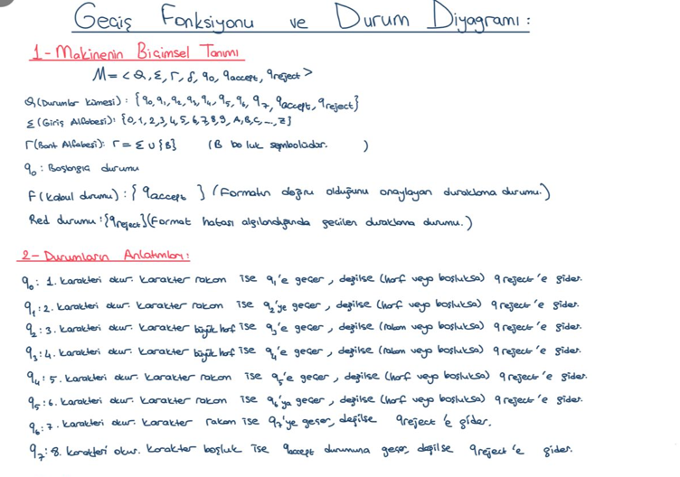

---

### Durum Geçiş Diyagramı
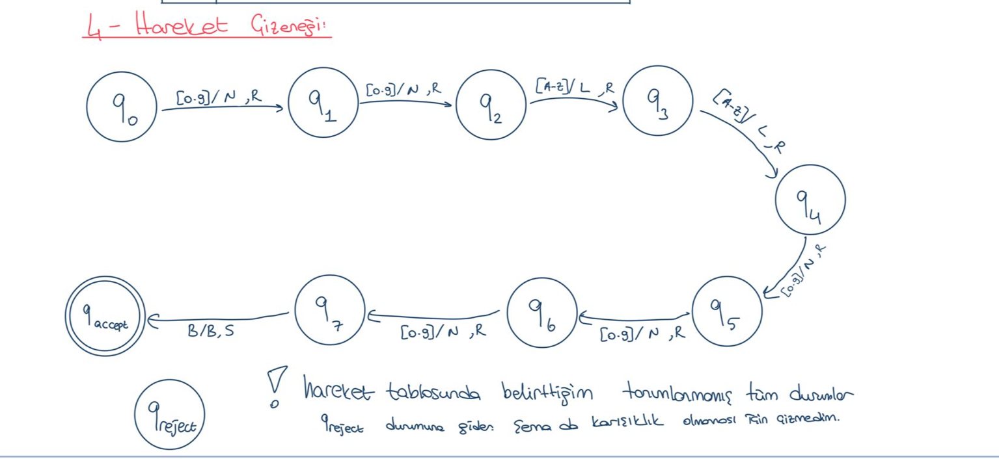

---

### Geçiş Tablosu
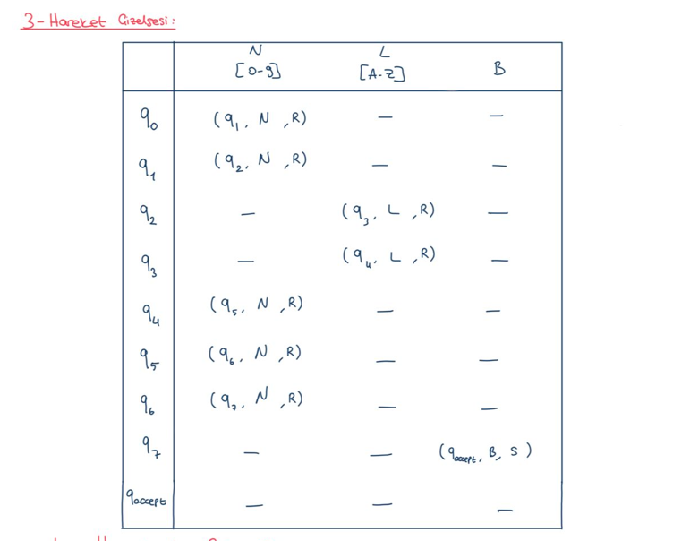

---

### Örnek 1: Geçerli Plaka Testi (55AB123)
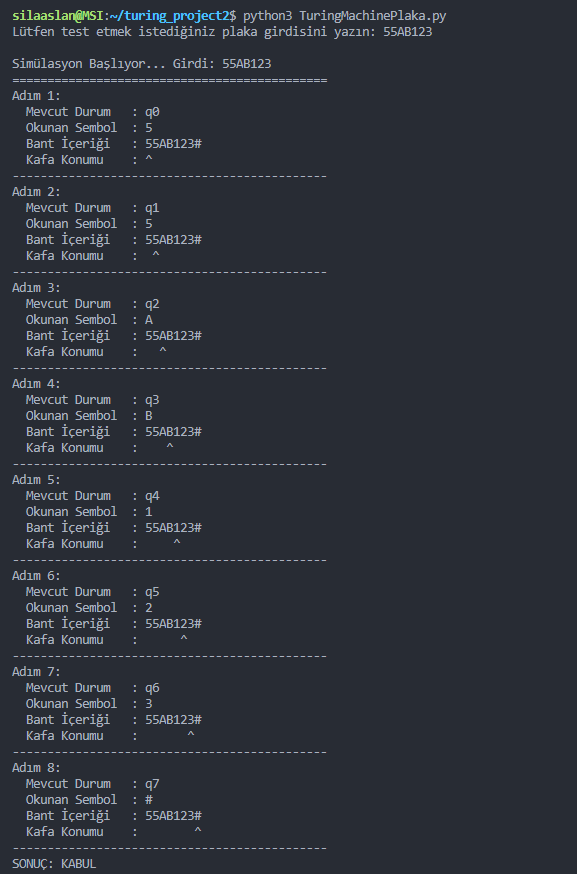

---

### Örnek 2: Geçerli Plaka Testi (34TR456)
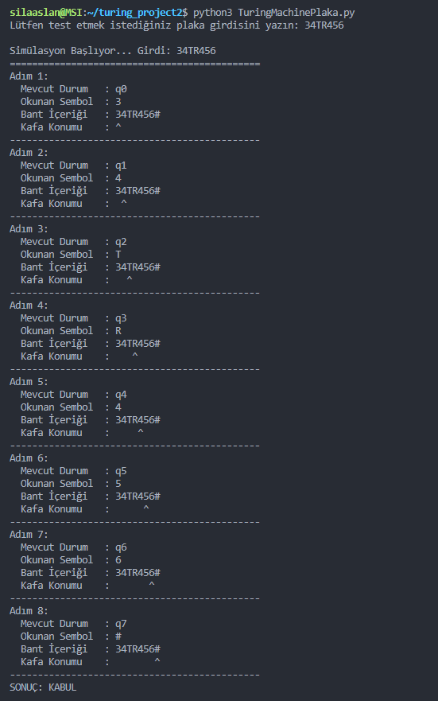

---

### Örnek 3: Geçerli Plaka Testi (06AA789)
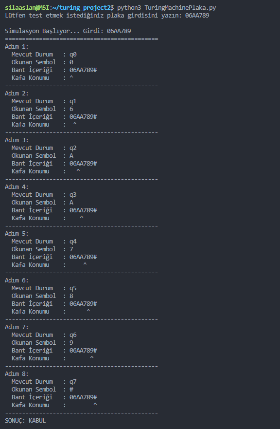

---

### Örnek 4: Geçerli Plaka Testi (99ZZ999)
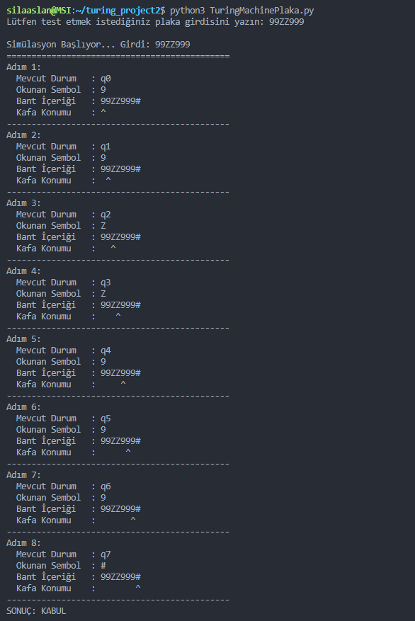

---

### Örnek 5: Geçerli Plaka Testi (10XY001)
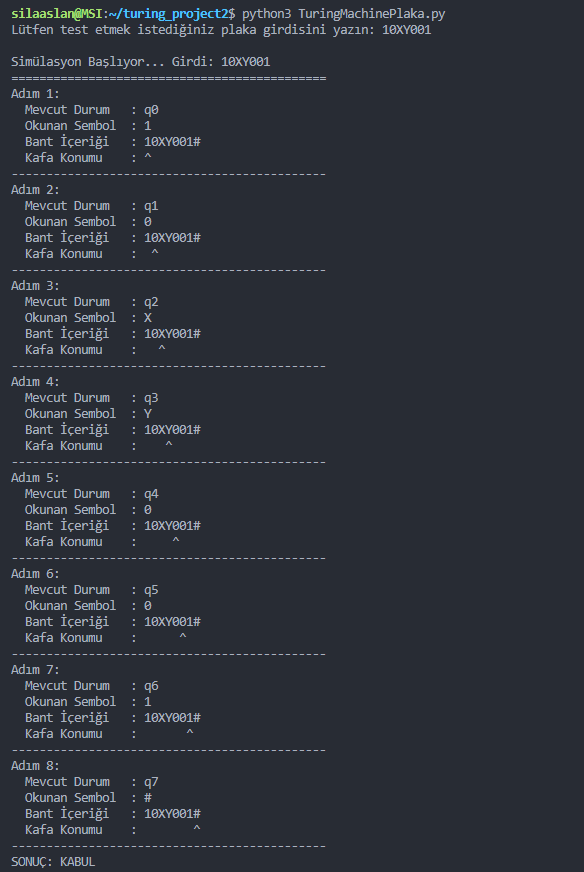

---

### Örnek 1: Geçersiz Plaka Testi (5AB123)
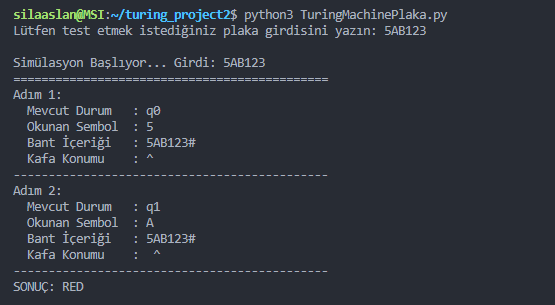

---

### Örnek 2: Geçersiz Plaka Testi (555AB12)
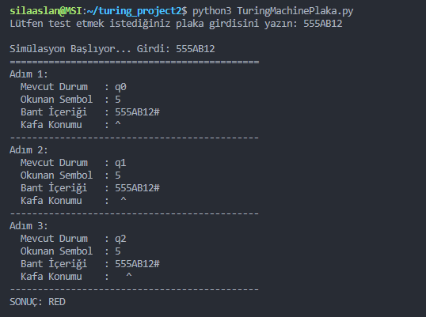

---

### Örnek 3: Geçersiz Plaka Testi (55ab123)
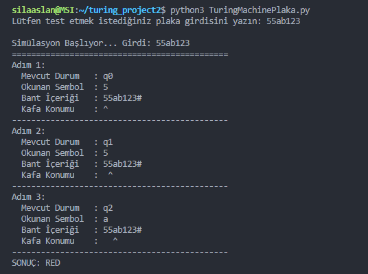

---

### Örnek 4: Geçersiz Plaka Testi (34AB1234)
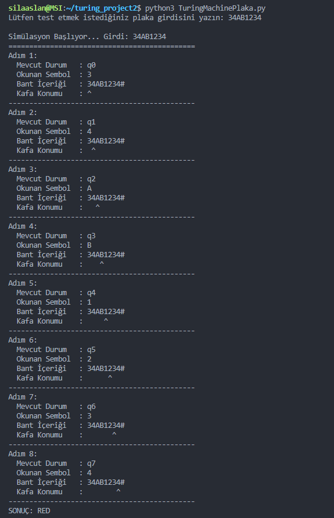

---

### Örnek 5: Geçersiz Plaka Testi (AB34123)
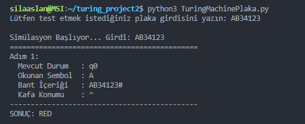

---

## Programı Çalıştırma
Proje klasörünün içindeyken terminal üzerinden aşağıdaki komutla simülasyonu başlatabilirsiniz:

```text
python3 TuringMachinePlaka.py
```
---

## Kullanılan Teknolojiler

- Python 3
- Turing Machine Simulation Models
- Formal Languages and Automata Theory
- State Transition Systems
